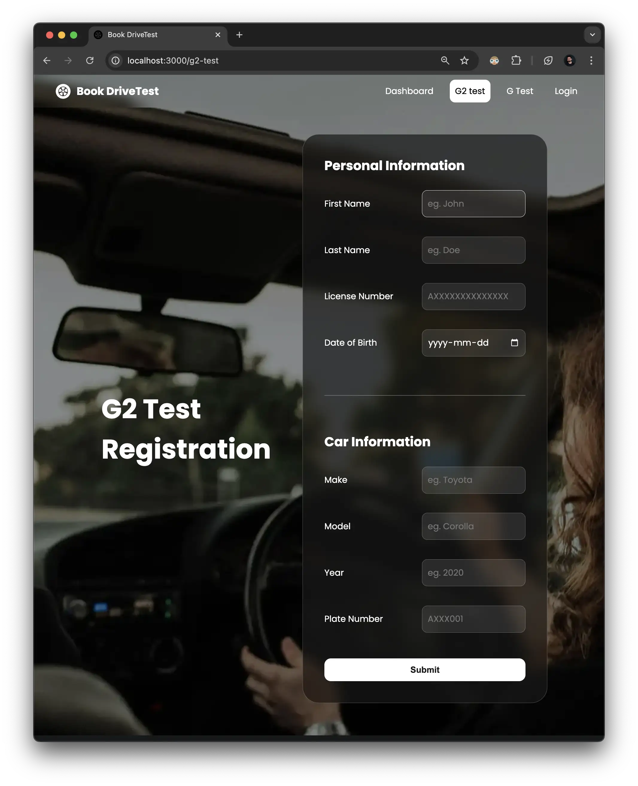

# Drive Test Booking System

This is a web-based application designed for booking drive tests in Canada. The project enables users to view available slots and book a test for their driving exam. The application uses server-side rendering with EJS templates and is built using Node.js with the Express framework.

## Technologies Used

- **Node.js**: JavaScript runtime for server-side development.
- **Express.js**: Web framework for handling HTTP requests.
- **EJS**: Embedded JavaScript for dynamic HTML templating.
- **HTML & CSS**: Frontend structure and styling.
- **Nodemon**: Automatically restarts the server on file changes during development.

## How to Run This Project

### Prerequisites
- [Node.js](https://nodejs.org/en/) (Ensure you have version 14.x or later)
- [NPM](https://www.npmjs.com/get-npm) (Usually comes with Node.js)

### Setup Instructions

1. **Clone the repository:**
   ```bash
   git clone git@github.com:bibintomj/bookdrivetest.git
   ```
   
2. **Navigate to the project directory:**
   ```bash
   cd drive-test-booking
   ```

3. **Install the dependencies:**
   ```bash
   npm install
   ```

4. **Run the server in development mode:**
   ```bash
   npm run dev
   ```

   This command uses Nodemon to restart the server automatically when file changes are detected.

5. **Open the application:**
   Navigate to `http://localhost:3000` in your browser to view and interact with the app.

### Important Commands

- `npm install`: Installs all necessary dependencies.
- `npm run dev`: Starts the server in development mode with Nodemon.
- `npm start`: Starts the server in production mode.

## Screenshots

### Dashboard


### G2 Booking


### G Booking


## About

This project was created as part of the assignment for **PROG8671-24F-Sec2-Full-Stack Programming** in the **Conestoga Web Development course**.
